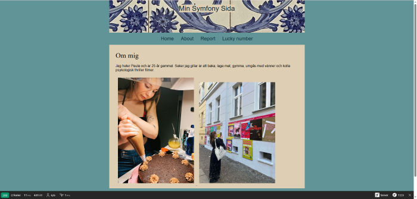

# Website with Symfony

A website for the MVC-course, made with object oriented PHP and the framework Symfony.

## Prerequisites
You have PHP, Composer and npm.

## Get started
git clone git@github.com:gitpau4/report-mvc.git
cd report-mvc
composer install
npm install
npm run build
symfony server:start